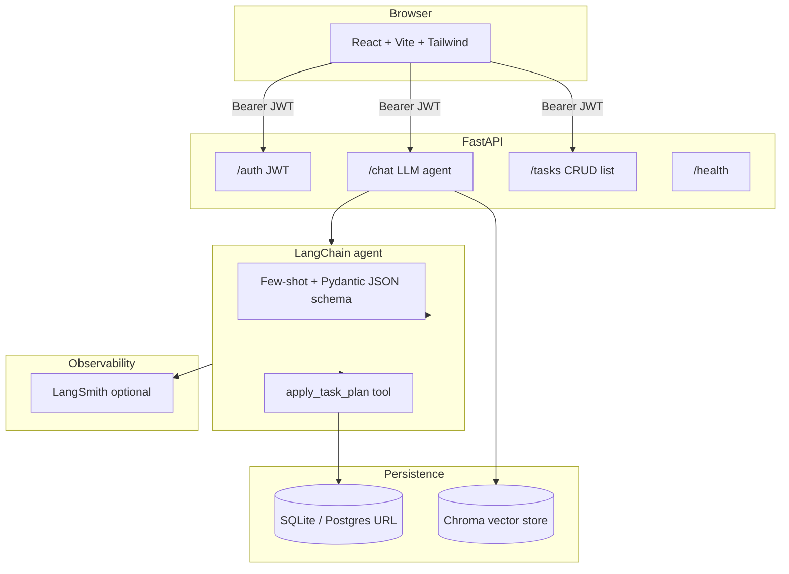

# LLM Task Management Assistant

Production-style full-stack app: **FastAPI** (JWT, modular routes), **LangChain** structured JSON planning + tool calls, **RAG memory** (Chroma + embeddings), **priority/scheduling engines**, **evaluation script**, **React + Tailwind** UI (chat + dashboard), **Docker Compose**, and **GitHub Actions CI**.

## Architecture



**Flow:** user message → LLM returns **structured `TaskPlan` JSON** (few-shot + schema) → optional **RAG retrieval** from Chroma → **priority scoring** + **scheduling** → persist **tasks**, **ICS calendar blobs**, **in-app notifications**.

## Repository layout

| Path | Purpose |
|------|---------|
| `backend/` | FastAPI app (`app/`), Dockerfile, `requirements.txt` |
| `frontend/` | Vite React app, production `Dockerfile` + `nginx.conf` |
| `docker-compose.yml` | Chroma + API (SQLite volume) |
| `.github/workflows/ci.yml` | Backend import check + frontend `npm run build` |

## Prerequisites

- Python **3.12+**
- Node **22+** (see `frontend/package.json`)
- **OpenAI API key** for chat/eval (memory/embeddings also use OpenAI when enabled)
- **Docker** (optional, for Compose)

## Quick start (local)

### Backend

```bash
cd backend
python -m venv .venv
.venv\Scripts\activate          # Windows
# source .venv/bin/activate     # macOS/Linux

pip install -r requirements.txt
copy .env.example .env          # Windows — then edit OPENAI_API_KEY
# cp .env.example .env

uvicorn app.main:app --reload --host 0.0.0.0 --port 8000
```

- API docs: `http://localhost:8000/docs`
- Health: `GET http://localhost:8000/health`

### Frontend

```bash
cd frontend
npm install
copy .env.example .env.local    # optional — set VITE_API_BASE if API is not on localhost:8000
npm run dev
```

Open the printed dev URL (default `http://localhost:5173`). Register → login → use **Chat** to create tasks → **Dashboard** lists persisted tasks.

### Chroma (optional, for RAG memory)

Point `CHROMA_URL` at a running Chroma HTTP server. With Docker Compose (below), use `http://localhost:8001` from the host.

## Docker Compose (API + Chroma)

From the repo root:

```bash
set OPENAI_API_KEY=sk-...          # Windows (PowerShell: $env:OPENAI_API_KEY="sk-...")
docker compose up --build
```

- API: `http://localhost:8000`
- Chroma: `http://localhost:8001` (mapped from container `8000`)

The backend container sets `CHROMA_URL=http://chroma:8000` and stores SQLite at `/data/dev.db` in a volume.

## Environment variables

See `backend/.env.example` and `frontend/.env.example`.

| Variable | Role |
|----------|------|
| `OPENAI_API_KEY` | Required for LLM + embeddings (memory) |
| `DATABASE_URL` | Async SQLAlchemy URL (default SQLite + `aiosqlite`) |
| `JWT_SECRET` | Sign JWT access tokens |
| `CHROMA_URL` | Chroma HTTP API base, e.g. `http://localhost:8001` |
| `LANGSMITH_API_KEY` | Optional tracing (wired in `app/main.py`) |
| `VITE_API_BASE` | Frontend API origin at build/dev time |

## Evaluation pipeline

Measures approximate **prompt accuracy** (title overlap vs. expected), **tool success** (tasks/notifications created), and **latency**. Writes `eval_results.json` under `backend/` (gitignored).

```bash
cd backend
set OPENAI_API_KEY=sk-...
python app/eval/evaluate.py
```

## CI

On push/PR to `main` or `master`, CI installs backend deps and imports `app.main`, and runs `npm ci && npm run build` in `frontend/`.

## Deployment notes

- **Backend:** containerize with `backend/Dockerfile`; run behind HTTPS termination; set strong `JWT_SECRET` and production `DATABASE_URL` (e.g. Postgres + `asyncpg`).
- **Frontend:** `frontend/Dockerfile` builds static assets and serves with nginx; set `VITE_API_BASE` at **build time** to your public API URL (`docker build --build-arg VITE_API_BASE=https://api.example.com`).
- **Vercel:** deploy the `frontend` folder as a static Vite app; configure `VITE_API_BASE` in the project env.

## License

MIT (or your choice — add a `LICENSE` file if you need a formal license).
